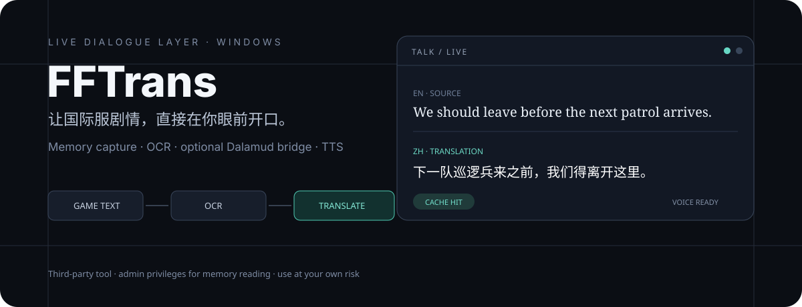
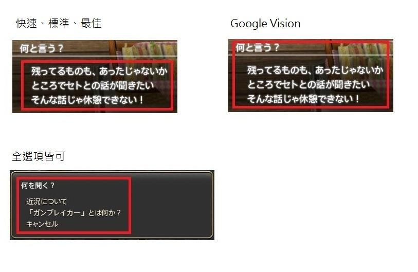

<p align="center">
  
</p>

# FFTrans

**Final Fantasy XIV 国际服实时翻译助手。** FFTrans 是 Windows Electron 应用：读取游戏对话与过场字幕，调用所选翻译引擎，并通过悬浮窗显示；也可选配 Dalamud 插件，把原文与译文写回普通 NPC `Talk` 对话框。

> [!WARNING]
> 读取游戏内存需要管理员权限。XIVLauncher、Dalamud 和其它第三方工具不符合 FFXIV 官方服务条款，可能带来账号风险；请自行判断并承担使用风险。

## 实际项目证明

<p align="center">
  
</p>

| 路径 | 作用 | 真实实现 |
| --- | --- | --- |
| 游戏文本 | 自动捕获对话与过场字幕 | `src/module/system/sharlayan-module.js` |
| 原生双语 Talk（可选） | Node 与 Dalamud 通过本地命名管道通信 | `src/module/system/dalamud-bridge.js`、`dalamud/FFTransDalamud/` |
| OCR | 框选屏幕区域后识别 / 翻译 | `src/module/ipc/capture-ipc.js` |
| 翻译 | NVIDIA、OpenRouter、Gemini、GPT、Kimi、OpenAI-compatible 自定义端点及传统翻译器 | `src/module/translator/` |
| 朗读 | ElevenLabs、Fish Audio、MiMo、Speechify | `src/module/translator/`、`src/module/system/tts-*` |
| 模型对比 | 在设置中并排查看已配置引擎的译文和延迟 | `src/html/config.js` |

中文术语修正与自定义修正位于 `src/data/text/` 和 `src/module/fix/`。Cloudflare Benchmark Lab 是仓库中的独立评测面，源码见 [`cloudflare-benchmark/`](cloudflare-benchmark/)。

## 安装与第一次使用

### 使用发布版

1. 从 [Releases](https://github.com/raydocs/fftrans/releases/latest) 下载 Windows 安装包。
2. 先启动 FFXIV 并进入游戏，再以管理员身份启动 FFTrans。
3. 在“设置 → 翻译”选择一个引擎；需要密钥的引擎请填入自己的 API Key。
4. 保存后用设置中的测试入口验证连接，再回到游戏查看字幕。

### 从源码启动

需要 Windows、Node.js 与 npm。

```bash
git clone https://github.com/raydocs/fftrans.git
cd fftrans
npm install
npm start
```

构建安装包：

```bash
npm run dist
# 输出目录：build/
```

## 可选：Dalamud 双语对话

FFTrans 仍保管模型、API Key、词典和缓存；插件只处理当前可见原文与本地桥接数据，不获取翻译密钥。

```powershell
powershell.exe -NoProfile -ExecutionPolicy Bypass -File scripts/build-dalamud.ps1
# 加 -Install 可复制到 XIVLauncher 开发插件目录
```

当前边界与安装方法见 [`dalamud/FFTransDalamud/README.md`](dalamud/FFTransDalamud/README.md)。

## 验证

```bash
npm run check:syntax
npm run lint
npm test
```

Dalamud 路径需要 Windows PowerShell / .NET 环境：

```bash
npm run test:dalamud
npm run test:all
```

## 常见故障

- **没有字幕**：确认游戏已进入、FFTrans 以管理员身份运行；再使用“设置 → 系统”的字幕读取器修复入口。
- **翻译请求失败**：先在所选引擎区域测试连接，检查 Key、模型名、网络与代理；可配置备用引擎。
- **OCR 不准**：提高截取区域文字尺寸 / 对比度，并在本地 Tesseract、Google Vision 或已配置的 AI 视觉之间切换。
- **TTS 无声**：先用当前引擎的试听验证授权；朗读失败不应阻断字幕显示。

## 安全提示

API Key、refresh token 和 bearer token 都是凭据。不要贴进 issue、截图、日志或聊天记录；仓库中的配置 UI 会把凭据交给本地应用使用，但凭据生命周期仍由对应服务决定。

## Credits & License

基于 [winw1010/tataru-assistant](https://github.com/winw1010/tataru-assistant)，并使用 Electron、Sharlayan、Tesseract.js、Sharp 等组件。完整条款见 [MIT License](LICENSE)。
